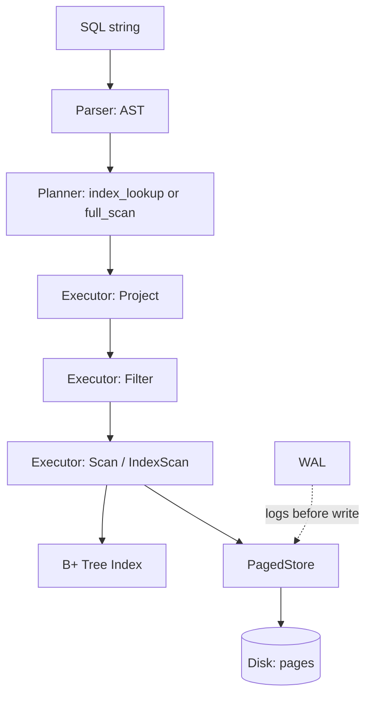

# PyDB

A database engine built from scratch in Python: page storage, a B+ tree index, a SQL pipeline, and WAL crash recovery.

## Overview

Educational database engine with real page-based storage, a B+ tree with splitting and range scans, a parse → plan → execute SQL pipeline, and tested crash recovery. What it does not have: No concurrency, no optimizer beyond one heuristic, no network layer.

## Architecture



## Features

- Page-based storage, 4096-byte pages, page/slot addressing
- B+ tree index: splitting, point lookup, range scan via leaf chaining
- SQL parser: `SELECT` (+ `WHERE`), `INSERT`
- Planner: index lookup vs. full scan, based on the predicate
- Iterator-model executor (generators, one row at a time)
- Write-ahead log: log + `fsync` before applying writes
- Crash recovery demo (`demo_crash.py`)
- Benchmarks: scan vs. index across table sizes
- 12 pytest tests

## How It Works

**Storage:** fixed 24-byte records in 4096-byte pages. `page = index // RECORDS_PER_PAGE`, `slot = index % RECORDS_PER_PAGE` - no scanning to locate a row.

**Index:** B+ tree, `id → row_index`. Internal nodes route; leaves hold data and link left-to-right for ranges. In-memory only - rebuilt from storage on startup.

**Query:** `query.py` parses SQL to an AST; the planner picks `index_lookup` for `id =` equality, else `full_scan`; execution is a `Project → Filter → Scan` generator chain.

**Durability:** insert = log+fsync → write to storage → update index → checkpoint. On startup, unapplied WAL entries are replayed before the index rebuilds.

## Example

```python
from engine import Database

db = Database()
db.create_table('users', 'users.db')
db.execute("INSERT INTO users VALUES (1, 'Hamoody')")

db.execute("SELECT name FROM users WHERE id = 1")
#-> [{'name': 'Hamoody'}]

db.explain("SELECT name FROM users WHERE id = 1")  #'index_lookup'
```

## Crash Recovery

`demo_crash.py` logs a write, then skips applying it, simulating a crash between the two. On restart, the WAL/checkpoint mismatch is detected and the entry is replayed:

```
[recovery] 1 unapplied WAL entry found -- replaying...
SELECT * FROM users WHERE id = 999 -> [{'id': 999, 'name': 'Ghost'}]
```

Covers missed writes, not a torn/partial page write mid-flight.

## Project Structure

| File | Purpose |
|---|---|
| `storage.py` | Page storage, byte addressing |
| `btree.py` | B+ tree: split, search, range |
| `wal.py` | Write-ahead log |
| `table.py` | Storage + index + WAL, recovery |
| `query.py` | Parser, planner, executor |
| `engine.py` | `Database.execute()` / `.explain()` |
| `demo_crash.py` | Crash/recovery scenario |
| `benchmark.py` | Scan vs. index timing |
| `test_minidb.py` | pytest suite |

## Testing

```bash
python -m pytest test_minidb.py -v
```

12 tests: page boundaries, B+ tree correctness under splitting, WAL recovery, parser/planner, end-to-end execution.

## Performance

| Rows | Full scan (ms) | Index lookup (ms) | Ratio |
|---:|---:|---:|---:|
| 100 | 3.49 | 0.044 | 79x |
| 1,000 | 53.38 | 0.058 | 913x |
| 6,000 | 320.51 | 0.029 | 11,203x |
| 12,000 | 616.42 | 0.045 | 13,802x |

Scan grows linearly (`O(n)`); index lookup stays flat (`O(log n)`).

## Limitations

No concurrency, transactions, or MVCC. Index not persisted (rebuilt on boot). No update/delete. WAL handles missed writes, not torn pages. No joins, aggregation, or `ORDER BY`. Not ACID-compliant.

## Learning Outcomes

Page/record layout, byte-offset addressing, B+ tree splitting and range chaining, complexity trade-offs (scan vs. tree), query planning and the iterator execution model, write-ahead logging and recovery ordering, index derivation, isolated test design, benchmark methodology.
